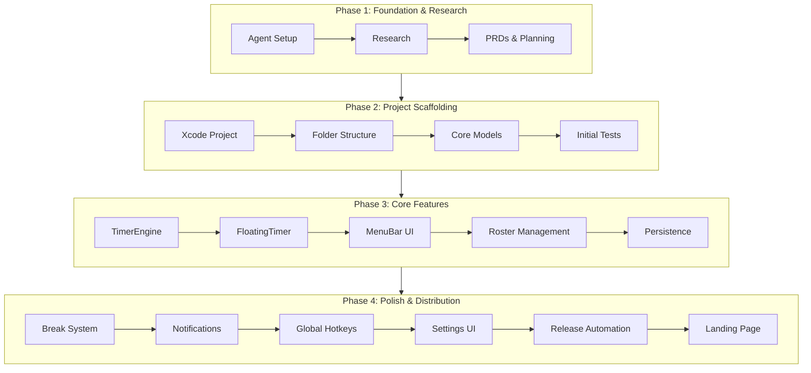

# MobCrew

A native macOS mob programming timer app, inspired by [mobster](https://github.com/dillonkearns/mobster).

Built with [Amp](https://ampcode.com) — see the [development thread](https://ampcode.com/threads/T-019c1ba0-b486-75bc-887b-14ddd6684695) for the full build history.

## Features

- **Timer** - Configurable turn duration with audio notifications
- **Roster management** - Driver/navigator rotation with drag-and-drop reordering
- **Bench** - Temporarily bench inactive mobsters
- **Floating timer** - Always-on-top window showing countdown
- **Break timer** - Full-screen break overlay with countdown
- **Global hotkey** - ⌘⇧M to rotate/start timer from anywhere (requires accessibility permission)
- **Menu bar** - Quick access from the menu bar
- **Auto-rotation** - Automatic driver/navigator swap when timer ends
- **Tips** - Support development via tip jar

## Known Limitations

- **Accessibility permissions reset on rebuild**: The app is currently ad-hoc signed, so macOS treats each build as a new app. You'll need to re-grant accessibility permission after rebuilding. See [code-signing-setup plan](.agents/plans/todo/code-signing-setup.md) for the fix.

## Download

Get the latest release from [GitHub Releases](https://github.com/colmarius/mobcrew/releases).

## Requirements

- macOS 14.0+
- Xcode 15+ (for development)

## Development

```bash
# Build
xcodebuild -project MobCrew/MobCrew.xcodeproj -scheme MobCrew -destination 'platform=macOS' build

# Run tests
xcodebuild test -project MobCrew/MobCrew.xcodeproj -scheme MobCrew -destination 'platform=macOS'
```

Or open `MobCrew/MobCrew.xcodeproj` in Xcode and use ⌘B (build), ⌘R (run), ⌘U (test).

```bash
# Build and run
./scripts/run.sh

# Run tests
./scripts/test.sh

# Run specific test class
./scripts/test.sh RosterTests

# Serve docs locally
./scripts/serve-docs.sh
```

## Manual Testing

See [TESTING.md](TESTING.md) for the full checklist.

## Releasing

Prerequisites: `gh` CLI and Node.js (`brew install gh node && gh auth login`)

```bash
./scripts/release.sh <version>
```

See [docs/RELEASING.md](docs/RELEASING.md) for the full release process.

## Project Evolution



| Phase | Description |
|-------|-------------|
| **1. Foundation** | Agent setup, research (Ghostty patterns, Elm→Swift porting), PRD creation |
| **2. Scaffolding** | Xcode project, folder structure, core models (Mobster/Roster/TimerState), tests |
| **3. Core Features** | TimerEngine, FloatingTimer (NSPanel), MenuBar, RosterView, PersistenceService |
| **4. Polish** | UI improvements, breaks, notifications, global hotkeys, settings, release automation |

## License

MIT
