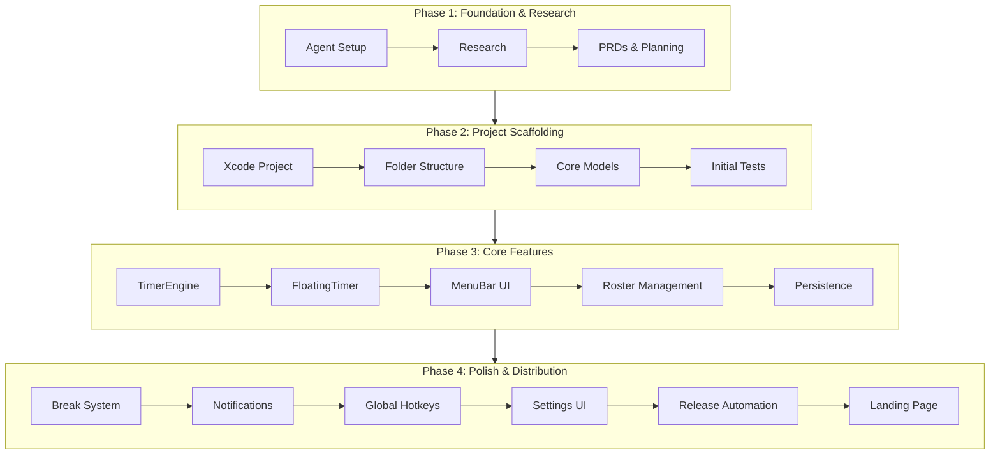

# MobCrew

A native macOS timer for pair, mob, and ensemble programming. MobCrew keeps the roster, current
driver and navigator, and rotation countdown visible so the team can rotate on time without
interrupting the session.

[Website](https://mobcrew.team/) ·
[View the latest release](https://github.com/colmarius/mobcrew/releases/latest) ·
[Report an issue](https://github.com/colmarius/mobcrew/issues)

## Features

- **Timer** - Configurable turn duration with audio notifications
- **Roster management** - Driver/navigator rotation with drag-and-drop reordering
- **Bench** - Temporarily bench inactive mobsters
- **Floating timer** - Always-on-top window showing countdown
- **Break timer** - In-window break screen with countdown
- **Global hotkey** - ⌘⇧L toggles the floating timer from anywhere (requires Accessibility
  permission)
- **Menu bar** - Quick access from the menu bar
- **Auto-rotation** - Automatic driver/navigator swap when timer ends
- **Programming tips** - Optional mob-programming quotations while the timer runs

## Requirements

- macOS 14.0 or later

The architectures in the current public release have not yet been independently inspected. The
repository's macOS CI currently tests an Apple-silicon (`arm64`) build, but that does not establish
the architecture of an older downloaded release.

## Install and first run

1. Open the [latest release](https://github.com/colmarius/mobcrew/releases/latest) and download its
   `MobCrew-<version>.dmg` asset.
2. Open the DMG and copy **MobCrew** to **Applications**, then eject the DMG.
3. Open MobCrew from Applications.
4. If macOS blocks this known download because it cannot verify the developer, open **System
   Settings → Privacy & Security**, review the blocked-app message, and choose **Open Anyway** only
   if the app is the MobCrew release you intended to download.

The current public release has not yet been independently qualified for Developer ID signing,
notarization, or exact Gatekeeper behavior on a clean Mac. The first-launch message and whether the
extra Privacy & Security step appears can therefore vary. Do not disable Gatekeeper or remove
quarantine attributes to install the app.

### Optional permissions

- **Accessibility:** used only so the fixed global shortcut **⌘⇧L** can toggle the floating timer.
  Choosing **Not Now** does not prevent the timer, roster, menu-bar controls, or floating-window
  controls from working. You can grant access later in **System Settings → Privacy & Security →
  Accessibility**.
- **Notifications:** requested when the timer is first started and used for optional turn and break
  alerts. The timer continues to work if notifications are denied, and alerts can also be disabled
  in MobCrew's General settings.

### Privacy, updates, and support

The current app code uses no account, telemetry, or network service. Roster and settings data are
stored locally in macOS user defaults, and the active roster is also written to MobCrew's local
Application Support folder.

MobCrew does not currently update itself. To update, download a newer release and replace the copy
in Applications. For help or bug reports, use [GitHub Issues](https://github.com/colmarius/mobcrew/issues).

## Development

Development requires a Mac with the full Xcode 26.6+ application and its Swift 6.3 compiler. Xcode
is not required just to install or run a release.


Built with [Amp](https://ampcode.com) (~$60 in tokens) — see the
[development thread](https://ampcode.com/threads/T-019c1ba0-b486-75bc-887b-14ddd6684695)
for the original build history.

```bash
# Build
xcodebuild -project MobCrew/MobCrew.xcodeproj -scheme MobCrew -destination 'platform=macOS' build

# Run tests
xcodebuild test -project MobCrew/MobCrew.xcodeproj -scheme MobCrew -destination 'platform=macOS'
```

Or open `MobCrew/MobCrew.xcodeproj` in Xcode and use ⌘B (build), ⌘R (run), ⌘U (test).

```bash
# Build and run
./scripts/run.sh

# Run tests
./scripts/test.sh

# Run specific test class
./scripts/test.sh RosterTests

# Serve docs locally
./scripts/serve-docs.sh
```

### Amp orbs

Fresh Linux orbs run [`.agents/setup`](.agents/setup), which validates the repository and starts
the landing page declared in [`.amp/services.yaml`](.amp/services.yaml). Run
`amp orb services ensure` to recreate the authenticated docs portal; [`.agents/resume`](.agents/resume)
checks the service again whenever an orb wakes.

MobCrew itself is a macOS-only Xcode target and uses AppKit, Carbon, and ServiceManagement. Linux
orbs cannot install Xcode, launch the app, or run Apple simulators. Build, test, and interact with
the app on a macOS Amp runner (or a local Mac) with Xcode 26.6+. The current project has no iOS target,
so running it in an iOS simulator would first require a separate iOS target and platform-specific
alternatives for the macOS APIs; the simulator would still need to run on macOS.

## Manual Testing

See [TESTING.md](TESTING.md) for the full checklist.

## Releasing

Prerequisites: `gh` CLI and Node.js 24+ (`brew install gh node && gh auth login`). The reproducible
development and CI runtime is exactly 24.19.0, selected by [`.nvmrc`](.nvmrc); local
release scripts accept compatible Node.js 24+ installations rather than rejecting newer versions.
DMGs use the repository-pinned `create-dmg` 8.1.0 release.

```bash
./scripts/release.sh <version> --draft
```

The script changes GitHub release state. Follow [docs/RELEASING.md](docs/RELEASING.md) to qualify the
exact draft artifact and publish that same tested draft; do not rerun the script without `--draft`
to publish a rebuilt artifact.

## Project Evolution


```mermaid
flowchart TB
    subgraph Phase1["Phase 1: Foundation & Research"]
        A[Agent Setup] --> B[Research]
        B --> C[PRDs & Planning]
    end

    subgraph Phase2["Phase 2: Project Scaffolding"]
        D[Xcode Project] --> E[Folder Structure]
        E --> F[Core Models]
        F --> G[Initial Tests]
    end

    subgraph Phase3["Phase 3: Core Features"]
        H[TimerEngine] --> I[FloatingTimer]
        I --> J[MenuBar UI]
        J --> K[Roster Management]
        K --> L[Persistence]
    end

    subgraph Phase4["Phase 4: Polish & Distribution"]
        M[Break System] --> N[Notifications]
        N --> O[Global Hotkeys]
        O --> P[Settings UI]
        P --> Q[Release Automation]
        Q --> R[Landing Page]
    end

    Phase1 --> Phase2
    Phase2 --> Phase3
    Phase3 --> Phase4
```

| Phase | Description |
|-------|-------------|
| **1. Foundation** | Agent setup, research (Ghostty patterns, Elm→Swift porting), PRD creation |
| **2. Scaffolding** | Xcode project, folder structure, core models (Mobster/Roster/TimerState), tests |
| **3. Core Features** | TimerEngine, FloatingTimer (NSPanel), MenuBar, RosterView, PersistenceService |
| **4. Polish** | UI improvements, breaks, notifications, global hotkeys, settings, release automation |

## License

[MIT](LICENSE). Inspired by [Mobster](https://github.com/dillonkearns/mobster).
